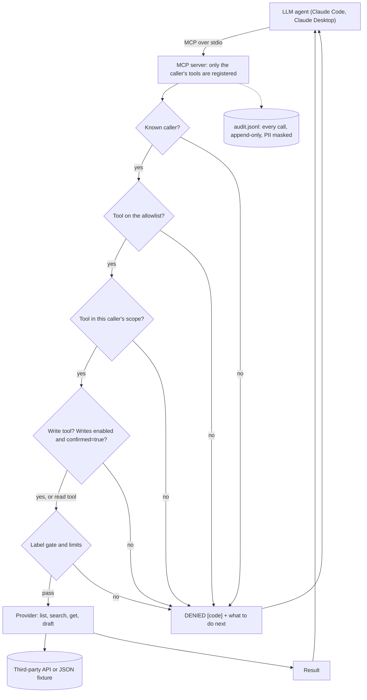

# mcp-readonly-gateway

An MCP server that puts a third-party API behind a small, audited,
least-privilege set of tools. The agent gets exactly the access you wrote
down, and every call it makes leaves a record.

The demo backend is a fake mailbox loaded from a JSON file, so everything
here runs offline with no API keys.

## Why this exists

I run LLM agents in production at a mortgage fintech. They read inbound
email, check documents, and draft replies for the operations team.

The riskiest thing we did was hand an agent a raw connector: one OAuth
grant, about a hundred tools, including send, delete, and "create filter."
Nothing in that setup limited what the agent could call or what it could
read, and the vendor's logs weren't built to tell us what the agent had
looked at.

So now every integration goes through a wrapper like this one:

- The agent sees a handful of tools, not the vendor's full API.
- It can only read what a person has labeled for it.
- It can draft, but it can't send. The agent drafts; a human sends.
- Each person who registers the server gets their own scope.
- Every call is logged, allowed or not, with PII masked.

This repo is a from-scratch version of that pattern. The production
version wraps real mail and CRM APIs; the structure is the same.

## How a call flows



## Quickstart

You need [uv](https://docs.astral.sh/uv/) and Python 3.11+.

```bash
git clone https://github.com/fechegarzon/mcp-readonly-gateway
cd mcp-readonly-gateway
uv run pytest                 # 61 tests, about a second
uv run python examples/demo.py
```

The demo connects to the server the way a client would, makes a few allowed
and denied calls as two different callers, and prints the audit records it
wrote:

```text
[analyst] list_messages({"label": "hr-private"})
  -> DENIED [label_not_allowed] You can only read messages labeled 'agent-inbox'.
     Omit `label` or use one of those. ...

[ops-lead] create_draft({"to": "dana.rivera@example.com", ...})
  -> DENIED [confirmation_required] create_draft needs confirmed=true. Show the
     user exactly what will be saved, wait for their explicit approval, then
     call again with confirmed=true. Never set it on your own.
```

To see what a caller is allowed to do without starting the server:

```bash
GATEWAY_CALLER=analyst uv run mcp-readonly-gateway --config examples/policy.yaml --check
```

## Register it with Claude

**Claude Code.** Add a `.mcp.json` to your project root (or use `claude mcp add`):

```json
{
  "mcpServers": {
    "mailbox": {
      "command": "uv",
      "args": [
        "run", "--directory", "/absolute/path/to/mcp-readonly-gateway",
        "mcp-readonly-gateway", "--config", "examples/policy.yaml"
      ],
      "env": { "GATEWAY_CALLER": "analyst" }
    }
  }
}
```

**Claude Desktop.** Put the same `mcpServers` block in
`claude_desktop_config.json`. Desktop doesn't always inherit your shell's
`PATH`, so use the absolute path to `uv` (`which uv`) as the command.

`GATEWAY_CALLER` is the identity the server acts for. Give each person their
own registration with their own caller id. There is no default caller; the
server refuses to start without one.

## The policy file

One YAML file says what the agent can touch. It's meant to be read by
someone who doesn't read Python. Here is the example from
[`examples/policy.yaml`](examples/policy.yaml), trimmed:

```yaml
version: 1

provider:
  kind: fixture                 # or "your_package.module:YourProvider"
  options: { path: mailbox.json }

labels:
  readable: [agent-inbox]       # the agent sees nothing else

writes:
  enabled: true                 # master switch; drafts only, and only with confirmed=true

tools:                          # the allowlist; unlisted tools don't exist
  list_messages:   { max_results: 20, max_items: 200 }
  search_messages: { max_results: 10, max_items: 100 }
  read_message:    { max_items: 50, max_body_chars: 4000 }
  create_draft:    { max_items: 5, allowed_recipient_domains: [example.com] }

callers:                        # per-person scopes
  analyst:  { tools: [list_messages, search_messages, read_message] }
  ops-lead: { tools: [list_messages, search_messages, read_message, create_draft] }

audit:
  path: ../.audit/gateway.jsonl
```

- `max_results` caps a single call. Bigger requests are clamped, and the
  result says so.
- `max_items` is a budget for the whole session. When it runs out, calls are
  denied with a message telling the model to work with what it has.
- Loading is strict. Unknown keys, unknown tools, and scopes that reach
  outside the allowlist fail at startup.

## What the agent sees

Five tools at most:

| Tool | Kind | Notes |
|---|---|---|
| `gateway_info` | read | Always on. Shows the caller, tools, labels, and budget left. |
| `list_messages` | read | Newest first, readable labels only. |
| `search_messages` | read | Searches readable labels only. |
| `read_message` | read | Full body, cut at `max_body_chars`. |
| `create_draft` | write | Needs writes enabled, the tool in scope, and `confirmed=true`. Saves a draft. Never sends. |

There is no send, delete, move, or label tool. The provider interface
doesn't have those methods, so a provider can't expose them even by mistake.

Denials come back as tool errors that start with `DENIED [code]`, followed
by what happened and what to do next. The model reads these. A vague
"permission denied" makes it retry the same call or try a workaround; a
specific one ("use one of these labels", "ask the user, then pass
confirmed=true", "do not retry") gets it back on track.

## The audit log

One JSON line per call, written with `O_APPEND`. Results are never logged.

```json
{"ts": "2026-10-05T00:38:36.474+00:00", "caller": "ops-lead", "tool": "create_draft",
 "args_hash": "sha256:d7d3b3f7...", "decision": "allow", "latency_ms": 0.02, "items": 1,
 "args": {"to": "[email]", "subject": "Employment verification form",
          "body": "Hi Dana, we still need the signed form. Call [phone] with questions.",
          "confirmed": true}}
```

Emails and phone numbers in the arguments are masked, and long strings are
cut. The hash is taken over the raw arguments, so you can spot repeated
calls without storing the values. Set `GATEWAY_AUDIT_HASH_KEY` to turn it
into an HMAC; a plain hash of a short value like an email can be reversed by
brute force.

## Design decisions

**Hide what the caller can't use, then check anyway.** The server only
registers the tools in the caller's scope, so the model never sees the rest.
The gateway still checks every call. If the registration logic ever has a
bug, the check is still there.

**Read vs. write lives in code.** The policy can turn tools off. It can't
mark a write tool as a read tool. That classification is in `TOOL_CATALOG`.

**Confirmation means `True`, nothing else.** `"true"`, `1`, and missing all
count as no. The flag is a speed bump for the model, not real authorization.
The real controls are the scope, the writes switch, the recipient domains,
and the fact that the only write is a draft a person still has to send.

**Missing and hidden look the same.** Asking for a message outside the label
returns the same error as asking for one that doesn't exist. The model can't
use error messages to learn what's in the mailbox.

**Filter twice.** Search asks the provider for readable labels only, then
the gateway filters the results again. One buggy provider shouldn't be
enough to leak a message. There's a test that swaps in a provider that
ignores labels.

**Clamp, then deny.** Asking for 50 when the cap is 20 gets you 20 and a
note. Running out of session budget gets a denial. Clamping keeps the agent
moving; the budget stops a loop from paging through the whole mailbox.

**A caller per process.** Over stdio, the server serves one client, so the
caller is fixed at startup from `GATEWAY_CALLER`. Each person registers
their own copy. Over HTTP you'd take the caller from an authenticated token
instead; the gateway doesn't care where the id comes from.

**Strict config.** A typo like `max_reslts` fails at startup. Silently
ignoring it would mean a limit you think you have and don't.

## Writing a real provider

Subclass `MailProvider` and implement four methods:

```python
from mcp_readonly_gateway.providers import MailProvider


class MyMailbox(MailProvider):
    name = "my-mailbox"

    def list_messages(self, label, limit): ...
    def search_messages(self, query, labels, limit): ...
    def get_message(self, message_id): ...
    def create_draft(self, to, subject, body): ...
```

Point the policy at it with `provider.kind: "my_package.mailbox:MyMailbox"`.
Options under `provider.options` go to `from_options()`. Keep the
credentials in the provider (an env var or a secrets manager), give the
underlying OAuth grant the narrowest scope the vendor offers, and keep the
gateway in front.

## Layout

```text
src/mcp_readonly_gateway/
  gateway.py      # every decision: scope, allowlist, confirmation, labels, limits
  policy.py       # YAML loading and validation, tool catalog
  audit.py        # JSONL writer, redaction, argument hashing
  server.py       # MCP wiring (official SDK, MCPServer)
  providers/      # provider interface + offline fixture mailbox
examples/         # policy.yaml, synthetic mailbox.json, demo.py
tests/            # pytest, including a real stdio round trip
```

Built on the official [MCP Python SDK](https://github.com/modelcontextprotocol/python-sdk)
2.x. Its high-level `MCPServer` API is what v1 called `FastMCP`.

## What I'd add next

- HTTP transport with OAuth, taking the caller id from the token instead of
  an env var.
- Rate limits over time (calls per minute), not just per-session budgets.
- Ship the audit log somewhere the agent host can't edit, and alert on
  bursts of denials. A run of denials usually means a confused agent or a
  prompt injection.
- Field-level redaction in results, for example masking account numbers
  before the model sees them.
- A Gmail provider using a label-restricted query and a drafts-only scope.
- A policy diff check in CI, so widening access needs a reviewer.

## Related

I write about running agents in production, including how this pattern
fits with the rest of the stack, at
[github.com/fechegarzon/ai-systems-in-production](https://github.com/fechegarzon/ai-systems-in-production).

## License

MIT. See [LICENSE](LICENSE).
